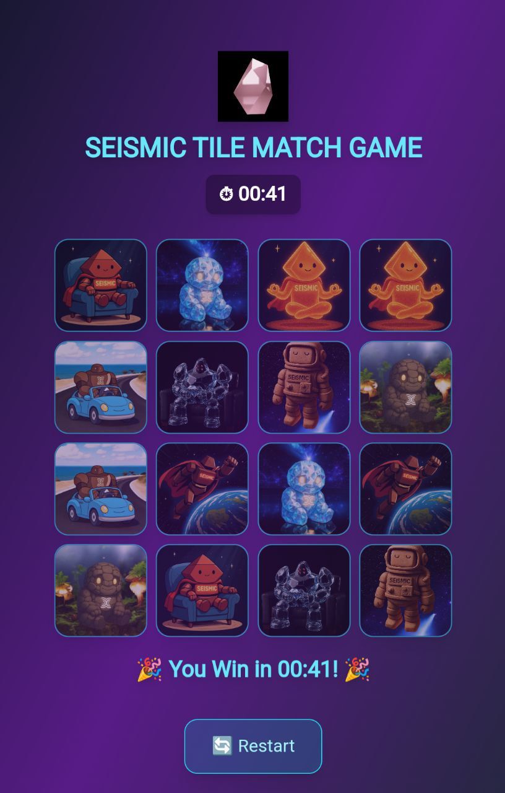

# 🎮 Seismic Tile Match Game
check here https://seismic-tile-game.vercel.app/

A fun and challenging **tile matching memory game** built with **Vite + React + Tailwind CSS**.  
Flip the tiles, match the pairs, and beat the timer!  
---

## ✨ Features
- 🧩 **Tile Matching Gameplay** – test your memory by finding matching pairs.  
- ⏱️ **Built-in Timer** – see how fast you can clear the board.  
- 📱 **Responsive Design** – plays smoothly on desktop and mobile.  
- 🎨 **Custom Images** – uses unique JPG/PNG tiles for a personalized touch.  
- ⚡ **Fast & Modern Stack** – powered by Vite and styled with Tailwind CSS.  

---

## 📸 Preview


---

## 🚀 Getting Started

### Clone the Repository
```bash
git clone https://github.com/Aman7535/seismic-tile-game.git
cd seismic-tile-game
